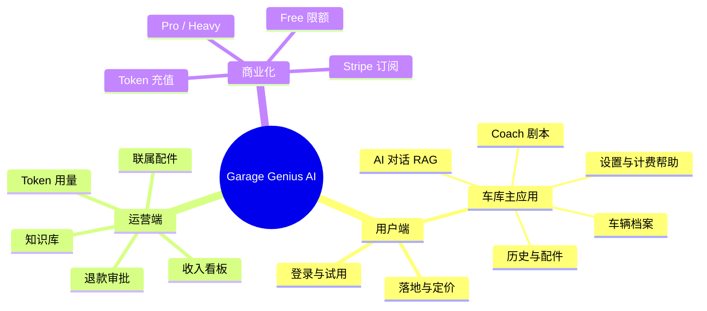
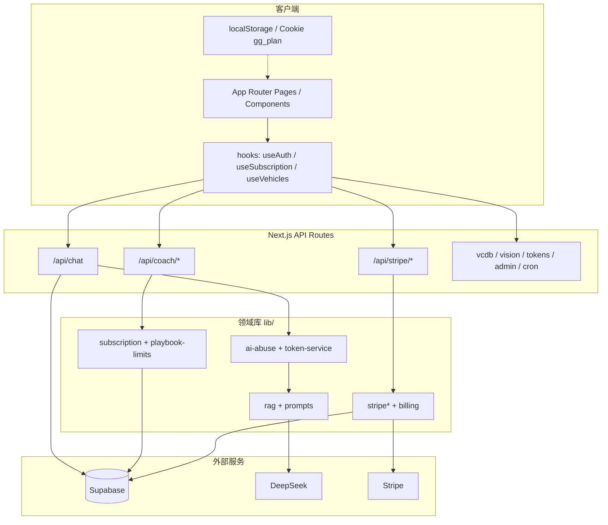
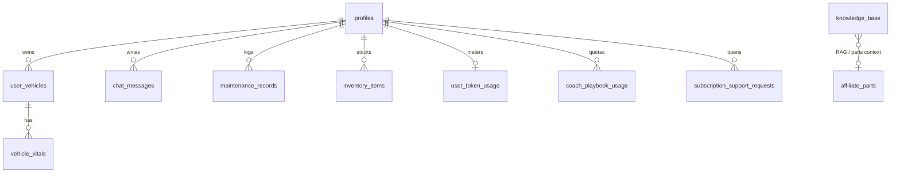

# Garage Genius AI — 系统架构说明

> DIY 汽车维修 AI 教练（Web 优先）：诊断对话、车辆仪表盘、Coach Playbook、配件库存、Stripe 订阅。  
> 部署目标：Vercel + Supabase + Stripe + DeepSeek。原生商店（Capacitor）为后续阶段。

---

## 1. 产品架构（Product Architecture）

### 1.1 产品树

```text
Garage Genius AI
├── 获客与合规
│   ├── 落地页 `/`
│   ├── 定价 `/pricing`
│   ├── 充值 `/recharge`
│   ├── 隐私 `/privacy` · 条款 `/terms`
│   └── 登录 `/login` · OAuth 回调 `/auth/callback`
│
├── 主应用 `/app`（AuthGate）
│   ├── Onboarding（无车辆时）
│   ├── Dashboard（车况 / Focus / 区域检查）
│   ├── Chat（RAG 诊断 · 拍照 · 语音）
│   ├── Coach Library → Scenario Player（27 生产 Playbook）
│   ├── History（保养/维修记录；Free 预览）
│   ├── Parts（库存 / 推荐）
│   └── Settings（订阅 · 语言 · Billing Help Coach）
│
├── Admin `/admin`
│   ├── 登录（Cookie HMAC）
│   ├── Knowledge 管理
│   ├── Affiliate Parts
│   ├── Token Usage
│   ├── Revenue
│   └── Support Refunds（人工审批退款）
│
└── 对外能力（API）
    ├── AI：`/api/chat` · `/api/dashboard/inspect` · `/api/vision/*`
    ├── Coach：`/api/coach/playbook-session` · `/api/coach/feedback`
    ├── Stripe：checkout · portal · recharge · webhook · support/*
    ├── 数据：`/api/vcdb` · `/api/tokens/usage` · `/api/push/subscribe`
    └── 运维：`/api/cron/maintenance-reminders` · `/api/admin/*`
```

### 1.2 产品模块关系（树状）



### 1.3 核心用户旅程

```text
注册/登录
  → 14 天 Pro Trial（profiles）
  → Onboarding 建车
  → Dashboard / Chat / Coach
  →（可选）升级 Stripe Checkout
  → Portal 管理/取消
  →（可选）Billing Help → 退款申请 pending_human
```

---

## 2. 技术架构（Technical Architecture）

### 2.1 技术栈树

```text
运行时与前端
├── Next.js 16（App Router）
├── React 19
├── Tailwind CSS 4 + lucide
└── i18next（en-US · es 外壳文案）

后端 / BaaS
├── Supabase Auth（Email · Apple · Google）
├── Supabase Postgres + RLS
├── pgvector / FTS（Hybrid RAG）
└── Edge Function（提醒，可选）

AI
├── DeepSeek（主对话 / 可选视觉）
├── Embeddings（OpenAI 或 DeepSeek，可选）
└── Browser Web Speech（Launch 语音）

支付与增长
├── Stripe Checkout / Portal / Webhook
├── Amazon Associates（可选）
└── Web Push（VAPID + sw.js）

部署
├── Vercel（生产 Web）
└── Capacitor（文档阶段，未落地 ios/android）
```

### 2.2 逻辑分层树



### 2.3 请求路径（关键流）

```text
Chat
  Client → POST /api/chat
    → requireAiUser + rate/token
    → ragService.retrieve（hybrid FTS ± vector）
    → buildChatSystemPrompt + VCdb card
    → DeepSeek stream/complete
    → chat_messages 云端落库

Coach
  CoachLibrary → Start
    → POST /api/coach/playbook-session（配额）
    → CoachScenarioPlayer（本地 JSON 剧本）
    → POST /api/coach/feedback（可选）

Billing
  Pricing → POST /api/stripe/checkout
    → Stripe Session（试用不叠注册试用）
    → webhook → profiles + stripe_subscriptions + revenue_events
```

---

## 3. 数据存储设计（Data Storage）

### 3.1 存储总览树

```text
数据平面
├── Supabase Postgres（主库 · RLS）
│   ├── 身份与计费
│   ├── 知识与配件目录
│   ├── 用户车库数据
│   └── 运营 / Coach / 风控
├── 客户端
│   ├── Auth session（localStorage）
│   ├── 偏好（语言 · 语音 · 市场）
│   └── 少量缓存（vitals / inspection）
├── 静态/语料（构建或 seed）
│   ├── content/coach-scenarios/*_production.json（27）
│   ├── scripts/data/*-knowledge-seed.json
│   └── manuals/（车主手册 ingest）
└── 可选本地 SQLite
    └── scripts/data/vcdb-cache.sqlite（VCdb 选车，gitignored）
```

### 3.2 Supabase 表域树（migrations 001–024）

```text
public schema
├── 身份与计费
│   ├── profiles                 # 订阅状态 · trial · stripe ids
│   ├── user_token_usage         # 月度 token
│   ├── token_purchases          # 充值包
│   ├── token_usage_events       # 用量事件
│   ├── stripe_subscriptions     # 订阅镜像
│   ├── stripe_revenue_events    # 收入事件
│   └── subscription_support_requests  # 退款等人工单
│
├── 目录与 RAG
│   ├── affiliate_parts
│   └── knowledge_base           # content · embedding · content_tsv · metadata.ingest_key
│       └── RPCs: match_documents · match_knowledge_fts · match_knowledge_hybrid
│
├── 用户车库
│   ├── user_vehicles            # + market · archive
│   ├── chat_messages
│   ├── maintenance_records
│   ├── inventory_items
│   └── vehicle_vitals
│
└── 运营 / Coach / 风控 / 飞轮
    ├── push_subscriptions
    ├── reminder_deliveries
    ├── ai_request_log           # 仅限流计数（非 prompt 日志）
    ├── coach_step_feedback      # Coach 步骤 yes/no
    ├── coach_playbook_usage     # Free 配额计数（非行为画像）
    ├── flywheel_review_queue    # 差评 → 人工审核
    ├── golden_qa                # 已审 Q&A → RAG / 微调导出
    └── rag_retrieval_events     # Chat RAG 命中 id/title 快照
```

### 3.2b 数据飞轮（执行层）

```text
生产信号
  coach_step_feedback(vote=no) ──即时/日 cron──► flywheel_review_queue
  chat RAG hits ──────────────────────────────► rag_retrieval_events
                                                      │
Admin /admin/knowledge/flywheel                       │
  填写正确 Q/A →「采纳为知识库」 ─────────────────────┤
                                                      ▼
                                              golden_qa
                                                      │
                         ┌────────────────────────────┼────────────────────────┐
                         ▼                            ▼                        ▼
                  knowledge_base              JSONL export              DeepSeek FT
                  (+ embedding 可选)          npm run train:golden       finetune.py（月度人工）
                  → 下次 RAG 即时生效
```

**注意：** `ai_request_log` / `token_usage_events` **不**存完整 prompt/completion；飞轮原料主要是 Coach 踩 + 人工修正 +（可选）Chat 召回快照。
### 3.3 知识语料树（seed → knowledge_base）

```text
scripts/data（及 Desktop autodata）
├── knowledge-seed.json              # 手工/通用
├── vcdb-knowledge-seed.json         # 车型配置模板
├── owner-reviews-knowledge-seed.json
├── dtc-knowledge-seed.json          # 故障码定义 EN
├── car-repair-qa-knowledge-seed.json # 中文修车 QA
├── car-fault-knowledge-seed.json     # 症状→系统分诊
└── car-brands50-knowledge-seed.json  # 品牌目录（非图片）
```

统一入库字段形状：`title` · `content` · `source` · `category` · `vehicle_*` · `metadata.ingest_key`（增量 `--only-new`）。

### 3.4 关键实体关系（简化）



---

## 4. 关键技术细节（Key Technical Details）

### 4.1 技术决策树

```text
关键设计
├── Auth
│   ├── Supabase PKCE + /auth/callback
│   ├── AuthGate 保护 /app（中间件看不到 localStorage session）
│   └── gg_plan Cookie = UX 软门禁（硬门禁在 API）
│
├── 权益与限额
│   ├── resolveSubscription（trial / pro / pro_heavy）
│   ├── PLAN_ENTITLEMENTS（语音 · 历史 · 年报 · 标签…）
│   ├── Free：5 playbook / 注册日起 30 日窗
│   ├── Free History：只读预览 3 条
│   └── QA_UNLOCK：等同 Heavy + 关支付（仅测试）
│
├── RAG
│   ├── 优先 hybrid（FTS ⊕ vector RRF）
│   ├── 无 embedding → FTS-only
│   ├── market / region 软过滤
│   ├── diy_skill 软排序（不硬过滤语料）
│   └── 提示词分层：config > owner/safety > repair > parts
│
├── DIY 段位（diy_skill）
│   ├── profiles.diy_skill: beginner | enthusiast | professional
│   ├── Onboarding 一键自报 + Settings 可改
│   ├── Chat system prompt 注入段位前缀（主杠杆）
│   ├── Coach「踩」软调 confidence；周 cron 推断升降级 + 站内通知
│   └── 勿用 coach_playbook_usage 做行为（仅配额）
│
├── Coach
│   ├── 仅 *_production.json 入 catalog（27）
│   ├── assertCoachProductionReady() 启动断言
│   ├── 高风险步 risk_confirm + 安全免责
│   └── 配额表 coach_playbook_usage（缺表 fail-open → 上线前必须有迁移）
│
├── Stripe
│   ├── Checkout 不叠第二次 trial（已有 trial_ends_at 则跳过）
│   ├── Webhook 同步 profiles + 订阅/收入表
│   └── 退款：用户申请 → pending_human → Admin 执行
│
└── 多端
    ├── 当前：响应式 Web + Push SW
    └── 后续：Capacitor 壳 + IAP/Stripe 双轨（见 docs/STORE_LAUNCH.md）
```

### 4.2 权限与门禁树

```text
访问控制
├── 公开：/ · /pricing · /privacy · /terms · /login · webhook
├── 用户会话：/app · /recharge · 多数 /api/*
├── Admin Cookie：/admin/* · /api/admin/*
└── 权益门禁
    ├── API：requireProUser / requireEntitlement / playbook-session
    ├── 软：middleware SOFT_GATED_APP_TABS（History 已改为预览）
    └── QA：isQaUnlockEnabled() 短路计费与支付
```

### 4.3 主要代码地图

```text
仓库根
├── app/                 # 路由与 API
├── components/          # UI（chat · coach · dashboard · admin…）
├── lib/                 # 领域逻辑（rag · stripe · coach · vcdb…）
├── content/coach-scenarios/  # 生产 Playbook JSON
├── locales/             # i18n
├── scripts/             # seed · train · ingest
├── supabase/migrations/ # 001–024
└── docs/                # 部署 · 商店 · 冒烟 · 本架构
```

### 4.4 环境变量（生产必需，摘录）

```text
必需
├── NEXT_PUBLIC_APP_URL
├── NEXT_PUBLIC_SUPABASE_URL / ANON_KEY
├── SUPABASE_SERVICE_ROLE_KEY
├── DEEPSEEK_API_KEY
├── STRIPE_SECRET_KEY · PUBLISHABLE · WEBHOOK_SECRET
├── STRIPE_PRICE_PRO_* · HEAVY_*
└── ADMIN_EMAIL · ADMIN_PASSWORD_B64

禁止生产开启
└── NEXT_PUBLIC_QA_UNLOCK / QA_UNLOCK
```

---

## 5. 一页总览树

```text
Garage Genius AI
│
├── 产品：DIY 教练 Web App（Dashboard · Chat · Coach · Parts · Billing）
├── 技术：Next 16 + Supabase + DeepSeek + Stripe @ Vercel
├── 数据：Postgres（profiles/RAG/车库/配额）+ JSON Playbook + Knowledge seed
└── 关键细节
    ├── Hybrid RAG + 市场过滤
    ├── 试用 + 权益 + Playbook 配额
    ├── Stripe Webhook 为计费真相源
    └── Web 先发 → 再 Capacitor / IAP
```

---

## 相关文档

| 文档 | 用途 |
|------|------|
| [`PROJECT.md`](../PROJECT.md) | 产品阶段与路线 |
| [`INTEGRATION.md`](../INTEGRATION.md) | 模块挂载与集成 |
| [`DEPLOYMENT_CHECKLIST.md`](../DEPLOYMENT_CHECKLIST.md) | 上线清单 |
| [`docs/INTERNAL_TEST_QUOTAS.md`](./INTERNAL_TEST_QUOTAS.md) | Unlimited 内测 vs Free/Pro 配额（防误判 G1/E3） |
| [`docs/SAFETY_INVARIANTS.md`](./SAFETY_INVARIANTS.md) | 不可关闭的安全不变量 |
| [`docs/AUTH_PROVIDERS.md`](./AUTH_PROVIDERS.md) | Apple / Google 登录 |

*文档版本：与仓库 migrations 001–024、27 生产 Playbook、Vercel Web 部署现状对齐（2026-07）。*
